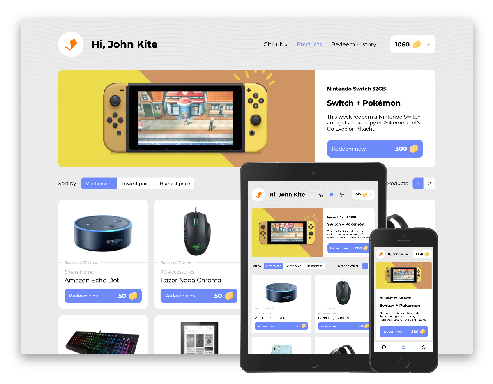
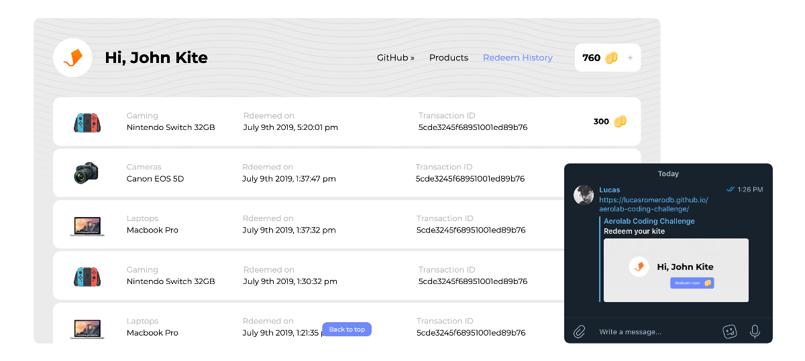
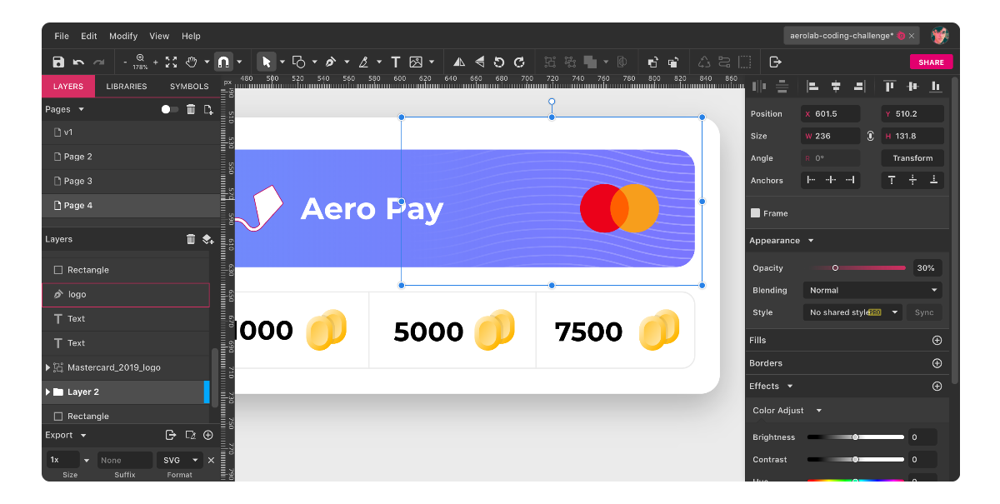

# Aerolab Coding Challenge

### [DEMO »](https://lucasromerodb.github.io/aerolab-coding-challenge/)

## Challenge info

- [Challenge »](https://aerolab.co/coding-challenge-instructions?utm_campaign=Coding%20Challenge)
- [API »](https://aerolabchallenge.docs.apiary.io/#reference/0/products/get)

## Extra features

- Entirely handcrafted design (based on original design concept and layout)
- Smooth appeareance and animations
- Featured product hero section
- Responsive (smartphone, tablet, laptop/desktop)
- Placeholder images
- Image quality depending on window width
- Cursor loading when redeeming any product
- Info about how many times a product was redeemed
- Pagination with numbers (increase dynamicaly)
- Display visible product range information
- Little dot notification when user points is under 500pt
- Aero Pay payment method (?
- Notifications on important actions
- Keyboard navigation
- Social metadata

## Tech Stack

- `create-react-app` for project starting
- `redux` and `redux-saga` for global state managing
- `react-router` for app routing
- `styled-components` for component styling (extended with `polished`)
- `styled-icons` for add icons to the app
- `moment` for date formating
- `gh-pages` for deployment
